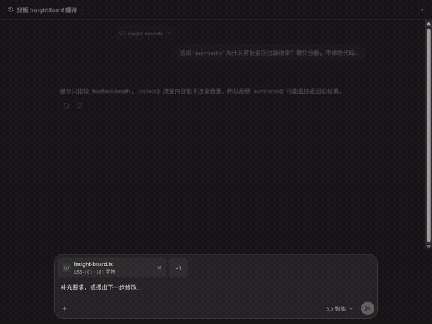

# Ask2GPT

> 把轻量的项目代码问答留在 VS Code，把 coding Agent 留给真正需要执行和改代码的任务。

[](./LICENSE)
[](https://github.com/FeyZha/ask2gpt/actions/workflows/ci.yml)
[](https://github.com/FeyZha/ask2gpt/releases/latest)

Ask2GPT 是一个只做编程问答的 VS Code 侧栏。它把你主动选择的代码和问题，经本机 Chrome
Relay 发送到已经登录的 ChatGPT 网页会话，再把回答流式显示回 VS Code。

- 不需要 OpenAI API Key；
- 不启动或调用 Codex/Coding Agent，因此不会占用这类 Agent 的任务额度；
- 不扫描项目，不执行 Shell、Git 或测试，也不写入工作区；
- 最终用户不需要 Node.js、pnpm 或命令行配置。

问题会受到你的 ChatGPT 账号套餐、网页端用量限制和网络状态约束。Ask2GPT 不是“无限额度”工具，
也不能替代会修改文件、运行命令和完成工程任务的 coding Agent。

> Ask2GPT 是独立开源项目，与 OpenAI 无隶属或官方合作关系，不包含 Codex 的私有代码、界面资源
> 或品牌资产。

## 看看它如何工作

[](./assets/demo/ask2gpt-demo.mp4)

[播放 960×720 MP4](./assets/demo/ask2gpt-demo.mp4) ·
[查看静态海报](./assets/demo/ask2gpt-demo.png)

演示中的代码、问题和回答全部来自仓库内的合成样例
[`examples/ask2gpt-tour`](./examples/ask2gpt-tour)，不包含真实账号、私人项目或真实聊天数据。

## 什么时候用 Ask2GPT

适合把这些“先问清楚”的工作交给 Ask2GPT：

- “这段实现的数据流和时间复杂度是什么？”
- “这个缓存为什么可能返回旧结果？”
- “比较两种数据结构的取舍，暂时不要改代码。”
- “基于这几个显式附加的文件，给出测试方案。”
- 在同一个远端会话里继续追问、澄清和比较方案。

如果任务需要搜索整个仓库、编辑文件、运行终端、验证构建或提交 Git，请继续使用 coding Agent。
Ask2GPT 的定位是低摩擦代码理解和方案讨论，而不是另一个自动执行代理。

## 安装：无需源码环境

要求：

- VS Code 1.96+
- Google Chrome 116+
- 能正常登录 `https://chatgpt.com/` 的 ChatGPT 账号
- 一个名称精确为 `Ask2GPT` 的 ChatGPT Project

从 [最新 GitHub Release](https://github.com/FeyZha/ask2gpt/releases/latest) 下载同一版本的三个文件：

- `ask2gpt-<version>.vsix`
- `ask2gpt-relay-<version>.zip`
- `SHA256SUMS.txt`

不要混用不同 Release 的 VSIX 和 Relay ZIP。

### 1. 安装 VS Code 扩展

1. 在 VS Code 命令面板运行 `Extensions: Install from VSIX...`。
2. 选择下载的 `ask2gpt-<version>.vsix`。
3. 按提示重新加载 VS Code。
4. 点击 Activity Bar 的 Ask2GPT 图标，或运行
   `Ask2GPT: 打开问答窗口 / Open Q&A`。

### 2. 安装 Chrome Relay

1. 把 `ask2gpt-relay-<version>.zip` 解压到固定目录。
2. 打开 `chrome://extensions`，启用“开发者模式”。
3. 点击“加载已解压的扩展程序”，选择刚解压的目录。
4. 建议把 Ask2GPT Relay 固定到 Chrome 工具栏，便于查看连接状态。

升级时完整替换解压目录并在扩展管理页点击“重新加载”；不要直接加载 ZIP，也不要同时保留多个
Relay 版本。

### 3. 第一次提问

1. 在 Chrome 登录 ChatGPT。
2. 创建或打开名称精确为 `Ask2GPT` 的 Project。
3. 回到 VS Code 的 Ask2GPT 侧栏发送问题。

Relay 会自动发现并保存这个 Project。若自动识别失败，可打开 Relay 弹窗并点击“绑定当前
Project”。本机多个 VS Code 窗口共享 Project 绑定，但端口、会话、标签页映射和运行状态彼此隔离。

## 三分钟体验教程

仓库提供了一个完全离线的 TypeScript 小项目。它只处理内存中的虚构反馈，不访问网络、文件系统或
环境变量。

1. 在 VS Code 打开
   [`examples/ask2gpt-tour/insight-board.ts`](./examples/ask2gpt-tour/insight-board.ts)。
2. 选中 `InsightBoard.summarize()`（约第 68–101 行）。
3. 点击 Ask2GPT 侧栏标题栏中的对话图标；也可以点击编辑器右上角图标、右键选区，或使用
   Composer 的 `+` →“当前选区”。
4. 在发送前检查侧栏里的文件名、行号、字符数和代码预览。
5. 直接选择“解释这段代码”“查找问题”“修复报错”“代码审查”“重构”“添加注释”
   “编写单元测试”或“分析性能或安全问题”。动作只会填入当前会话的可编辑草稿，不会自动发送；
   也可以从空白输入框自行提问。
6. 编辑并发送：

   > 请用简单语言解释这段代码的数据流，并分析时间复杂度。只分析，不修改代码。

7. 回答出现 `insight-board.ts:68` 或 `summarize()` 时，点击引用可回到对应源码行或函数定义；
   点击已发送的上下文卡片也可回到原始选区。
8. 在编辑器重新选中这段代码，运行“查找关联对话”，可跳回刚才的问题轮次；匹配标记会保留到
   手动清除，并精确标出命中的上下文卡片。
9. 在同一会话继续问：

   > `replace()` 和重复标签会怎样影响结果？请按优先级解释。

10. 点击 Composer 的 `+`，显式附加当前文件，再问：

    > 从数据所有权和缓存一致性两个角度比较三种修复方案。

更多可复制的问题和预期体验见
[`examples/ask2gpt-tour/README.md`](./examples/ask2gpt-tour/README.md)。Ask2GPT 不会修改这个样例。

Notebook 体验可直接打开
[`examples/ask2gpt-tour/notebook-tour.ipynb`](./examples/ask2gpt-tour/notebook-tour.ipynb)：在 Code Cell
中选中源码后使用 Cell 标题栏的 Ask2GPT 图标；没有文本选区时会附加当前完整 Cell，也可以先选择
多个 Cell，再从 Notebook 工具栏或 Composer 的 `+` 附加。Markdown Cell 同样可作为上下文，但不会
显示代码专用快捷动作。

## 已实现功能

- 独立问答侧栏、Markdown/GFM、ChatGPT 风格代码块、块内复制、多色语法高亮和流式回答；
- 新建、切换、重命名、归档、撤销归档和本地恢复会话；
- ChatGPT 标题及当前可见分支历史同步；
- 自动同步账号当前可用的模型和推理档位；
- 停止、重新生成、排队追问或停止后发送；
- 通过 Ask2GPT 侧栏标题栏、编辑器标题栏、右键菜单、命令面板或灯泡 Quick Fix 显式附加当前选区；
- 通过 Composer 的 `+` 显式附加当前选区、当前文件或多个文本文件；
- 在 `.ipynb` 中通过 Cell 标题栏、Notebook 工具栏、命令面板或 Composer 的 `+` 附加 Cell 内选区、
  当前 Cell 或多个所选 Cell；Code 与 Markdown Cell 都保持独立的紧凑上下文卡片；
- 选区附加后直接提供 8 个代码任务快捷动作；点击只填入按会话隔离的可编辑草稿，绝不自动发送；
- 发送前预览和逐项移除上下文，并拒绝敏感文件、二进制和超限内容；
- 代码上下文始终以附件胶囊封装，ChatGPT 可见问题不再展开文件元数据或源码；
- 上下文卡片可跳回源码；Host 只把回答前最近一条用户消息所附代码中的 `file:line` 与函数定义
  标为可点击，未附加引用保持普通文本；
- 编辑器选区可凭唯一内容证据反查已发送的对话轮次，并持续标出精确上下文卡片直到手动清除；
- Notebook 上下文持久化 `NotebookSourceAnchorV2`；上下文卡片、回答中的 Cell 附件行号、Cell 内函数
  定义以及编辑器 Cell 选区都可双向追踪。Cell 移动后只在内容与邻接证据唯一时重定位，重复或删除
  时明确失败；
- 空白草稿在 VS Code Reload 后保持同一会话 ID，且在明确派发意图前不会创建 ChatGPT 标签页；
  点击、聚焦或输入 Composer 会启动派发预热，但不会把未提交的问题写入网页；
- Relay 以三个并发槽为软容量复用自己创建且经页面空闲证明的标签页；不安全时允许临时溢出，
  借用页、旧版来源不明页和用户手动激活页都不会被自动复用或关闭；
- Relay Popup 显示标签页池的候选估算，并只允许清理执行时再次通过空闲证明的 Relay 自建页面；
- 多 VS Code 窗口独立路由、重启恢复和终态去重；
- AES-256-GCM 加密的扩展私有会话存储；
- Chrome 最小化时的增强后台流式接收。

当前发布元数据：

- 当前版本：`0.1.3`
- Relay 协议：`v15`
- 内容运行时：`50`

## 数据与安全边界

Ask2GPT 只读取用户明确选择的内容：

- 当前选区；
- 当前编辑器内存中的文本；
- 用户明确附加的 Notebook Code/Markdown Cell 源码；
- 用户在系统文件选择器中确认的文本或代码文件。

它不会枚举、搜索或推断工作区中的其他文件。`.env*`、私钥、证书、keystore、常见凭据文件、
二进制文件和超过大小限制的内容会被拒绝。问题、代码上下文和回答会经过本机 loopback，并按用户
操作发送到 ChatGPT；Cookie、访问令牌和网页存储不会发送给 VS Code，也不会写入诊断日志。
回答中的源码引用只会在回答前最近一条用户消息明确附加的上下文中解析；其他看似路径或函数的文字
保持普通文本。选区快照缺失或在当前文件中重复出现时，源码跳转会明确失败，不会猜测旧行号。
Notebook 始终按 Cell source 捕获，不读取或发送原始 `.ipynb` JSON、Cell outputs、execution
metadata、widget 状态、富 HTML、图片或 base64 负载；从普通文件入口选择 `.ipynb` 会被拒绝。
所有上下文共同遵守最多 8 项、单项 40,000 字符、合计 60,000 字符的限制。
已发送普通文本上下文会持久化 `SourceAnchorV1`，Notebook Cell 会持久化
`NotebookSourceAnchorV2`，包含内容、Cell 与邻接 Cell 哈希等定位元数据；反查仍只接受同一资源下
的唯一内容证据。Ask2GPT 不会为了定位引用而搜索工作区。
为避免超长历史阻塞编辑器，回答来源按钮只为当前会话最近 200 条终态回答建立有界索引；更早回答
仍可阅读，但其中的路径和符号保持普通文本。

VS Code 与 Relay 使用 `127.0.0.1:32171–32180` 上的 protocol v15 WebSocket。连接会校验固定扩展
身份、Origin、产品/协议版本、消息方向、schema、大小和目标窗口。loopback 没有 TLS 或对本机进程的
密码学认证，因此适用于用户信任本机进程的个人开发环境，不适合需要抵御本机恶意进程的高安全环境。

Chrome Relay 申请 `tabs`、`storage`、`alarms`、`debugger`、`scripting`，以及
`https://chatgpt.com/*`、`http://127.0.0.1/*` 的主机权限。它不申请 cookies、history、downloads、
nativeMessaging、剪贴板或文件 URL 权限。权限用途和完整威胁模型见
[`SECURITY.md`](./SECURITY.md)。

## 常见问题

**VS Code 显示 Relay 未连接**

确认 Chrome Relay 已启用且版本与 VSIX 一致，然后重新加载 VS Code。Relay 会自动探测
32171–32180，无需配对码。

**找不到 ChatGPT Project**

确认已登录 ChatGPT，Project 名称精确为 `Ask2GPT`。打开该 Project 后，可在 Relay 弹窗手动绑定。

**升级后仍显示旧版本或旧运行时**

完整替换 Relay 解压目录，在 `chrome://extensions` 重新加载扩展，并重新加载 VS Code。不要让两个
Relay 版本同时启用。相邻 patch 组合只支持滚动升级，不支持让旧 Relay 二进制读取新版本写入的
状态；不要让 0.1.3 Relay 降级读取新版本状态，正式安装应让 VSIX 与 Relay 保持同版。

**升级前留下了很多 Ask2GPT Project 标签页**

打开 Relay Popup 查看“标签页池”。其中候选数量是读取时的估算；“清理安全闲置页”会逐页二次
证明，并只关闭 Relay 能证明为自己创建、当前空闲且
没有草稿、附件、生成任务、终态确认或用户接管的页面。升级前来源不明的 Project 根页和 Relay
借用的既有会话页不会自动关闭；请先在 Chrome 标签栏确认内容，再手动关闭。

**ChatGPT 要求登录、验证码或提示频率限制**

请在 Chrome 中人工完成登录或验证，并等待网页端限制解除。Ask2GPT 不绕过 CAPTCHA、账号限制或
ChatGPT 的安全提示，也不会在发送结果不确定时自动重发问题。

## 已知限制

- ChatGPT 页面结构、模型目录或会话协议变化后，可能需要更新兼容层；
- 使用量、可用模型、生成速度和频率限制由 ChatGPT 账号与网页端决定；
- 不支持图片、二进制、Deep Research、Web Search 或 Apps；
- Notebook 首版只支持 Code/Markdown Cell 源码；不附加整个 `.ipynb`，也不传输 Cell 输出、图片、
  HTML 或 widget；
- 只同步已映射会话的当前可见分支，不扫描全部 ChatGPT 历史或不可见分支；
- 文件重命名或移动后，基于原 URI 的上下文跳转与对话反查可能失效；Ask2GPT 不会搜索工作区来
  猜测新位置；
- GitHub Release 安装 Chrome Relay 仍需开发者模式；自动更新需要后续发布到扩展商店；
- 不执行代码、不修改文件，也不提供 Agent 工具调用。

## 从源码构建

开发要求：Node.js 22.13+ 或 24+，以及通过 Corepack 固定的 pnpm 11.20.0。

```powershell
corepack enable
pnpm install --frozen-lockfile
pnpm audit:dependencies
pnpm verify
pnpm package
```

`pnpm verify` 会检查格式、类型、ESLint、架构边界、源码隔离、第三方许可证、单元/集成测试、
Webview 预览、smoke harness 和生产构建。`pnpm package` 会生成并复核 VSIX、Relay ZIP、MIT
许可证及第三方声明；生成包被 Git 忽略，只由 GitHub Release/CI 发布。

真实登录态 smoke 会创建合成 ChatGPT 会话，只应在已准备测试账号和 Chrome 环境时运行：

```powershell
pnpm smoke:live -- --host-count 1 --model-id mode-fast --connection-timeout-ms 90000 --generation-timeout-ms 180000
```

## 项目文档

- [`ARCHITECTURE.md`](./ARCHITECTURE.md)：组件、协议、状态机和恢复边界
- [`SECURITY.md`](./SECURITY.md)：权限、数据处理和威胁模型
- [`MANUAL_QA.md`](./MANUAL_QA.md)：发布前人工验收
- [`CONTRIBUTING.md`](./CONTRIBUTING.md)：开发、测试和贡献流程
- [`CHANGELOG.md`](./CHANGELOG.md)：版本变更

## License

[MIT](./LICENSE)。随安装包分发的第三方许可证与版权声明见
[`THIRD_PARTY_NOTICES.txt`](./THIRD_PARTY_NOTICES.txt)。
